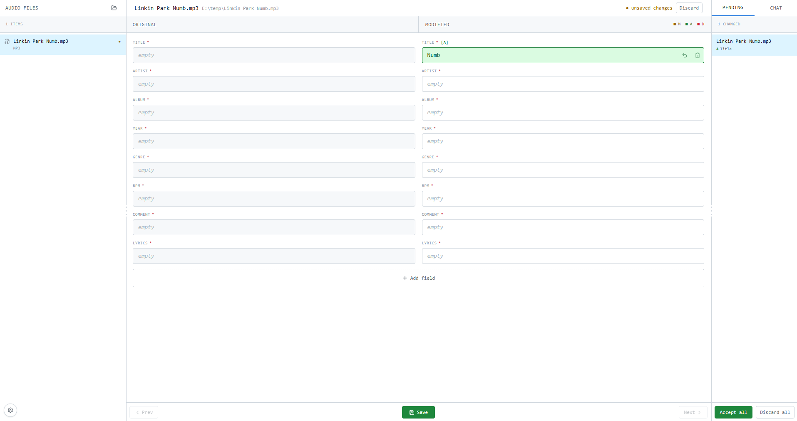

# mutag

[English](../README.md) | [简体中文](README_CN.md)

优雅的音频标签编辑软件。

## Introduction



mutag 是一个跨平台的音频标签编辑桌面应用程序，基于 Electron + React 构建，提供直观的侧边对比界面，用于浏览、修改和管理音频文件元数据。

### 功能与用途

- **标签编辑** - 支持常见音频格式（MP3、FLAC、WAV、M4A、OGG 等），可直接修改内嵌元数据字段，如 Title、Artist、Album、Year、Genre、BPM、Lyrics 等。
- **批量处理** - 选择文件夹后自动递归扫描（最多 5 层），所有音频文件会显示在左侧列表中，支持逐个保存或通过 `Accept all` 一次性批量写入。
- **视觉对比** - 编辑界面采用左右对照布局：左侧显示原始 (Original) 标签值，右侧显示修改后 (Modified) 标签值，变更字段通过颜色和徽章（M/A/D）标记，便于确认改动。
- **自定义字段** - 除默认核心字段外，可通过菜单添加更多标签字段，例如 Composer、Album Artist、Track Number、ISRC、MusicBrainz ID 等，满足高级元数据管理需求。
- **Chat 助手** - 内置 LLM 聊天面板，可连接 OpenAI 兼容 API，让 AI 根据上下文批量修改标签。
- **文件重命名** - 修改 Title 并保存后，文件会自动重命名为 `{track_number} {title}.ext` 格式；`track_number` 自动补为两位数，无 `track_number` 时直接使用标题。
- **标签校验** - 保存时自动检查 Title 是否为空、同目录下是否存在重复标题；校验失败时通过主题化 Toast 提示错误，防止产生无效数据。
- **持久化恢复** - LLM 配置、布局偏好、默认字段列表等全局设置保存在系统临时目录；编辑中的未保存修改和聊天记录会自动同步到当前项目目录下的 `mutag.json`，下次打开时自动恢复现场。

### 特点

- **本地优先** - 所有标签读写操作通过 Electron 主进程直连本地文件系统，无需网络或后端服务。
- **即选即扫** - 选择文件夹后递归扫描音频文件，扫描期间显示骨架屏，避免白屏等待。
- **键盘友好** - 支持方向键（↑/← Prev，↓/→ Next）快速切换文件，提升批量编辑效率。
- **主题一致** - 界面风格参考 GitHub UI，使用 Tailwind CSS 实现，无需额外设计依赖。
- **轻量无侵入** - 不修改音频文件目录结构之外的任何内容；重命名规则清晰可预期。

## 项目结构

```text
src/
  main/       Electron 主进程
  preload/    Electron preload API
  renderer/   React 渲染进程界面
  shared/     主进程和渲染进程共享的类型
```

## 开发

```powershell
git clone https://github.com/TecReaGroup/mutag
cd mutag
npm install
npm run dev
```
